# 📊 Funnel Analysis Project (Python)

## 📌 Overview
This project analyzes employee attrition using SQL to uncover key patterns behind why employees leave an organization. The goal is to help HR teams make data-driven decisions to improve employee retention.

## 🎯 Problem Statement

- Analyze employee attrition rate
- Identify factors affecting employee turnover
- Compare attrition across departments, job roles, and demographics
- Extract actionable insights using SQL queries
- Support HR decision-making with data

## 🧠 Project Structure 
#### Cleaning and Transform data 

1. Data types
2. Data Consistency Stage
3. Null values
4. Outliers
5. Create new columns (Date , Time , Total Sessions Per User, Purchase Counts Per User,Time Segments)

#### Analysis and Visualization
- Purchase vs Non-Purchase Sessions
  
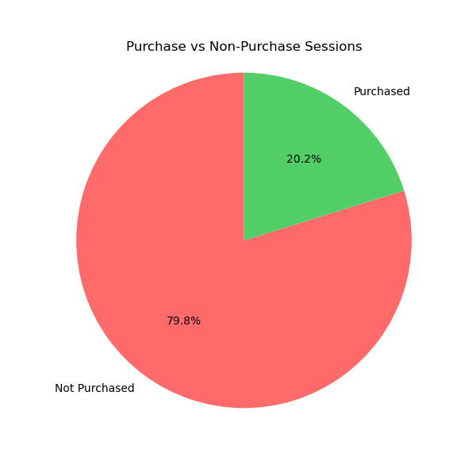
###### 20% only the Conversion rate

- 'Distribution of Purchase Counts Per User
  
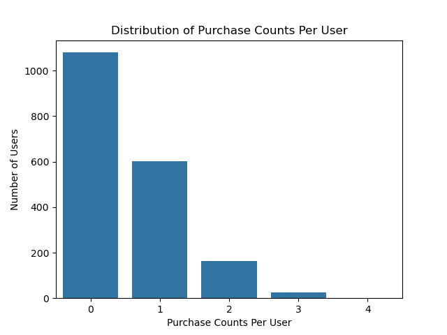

- Distribution of Total Session Per User
  
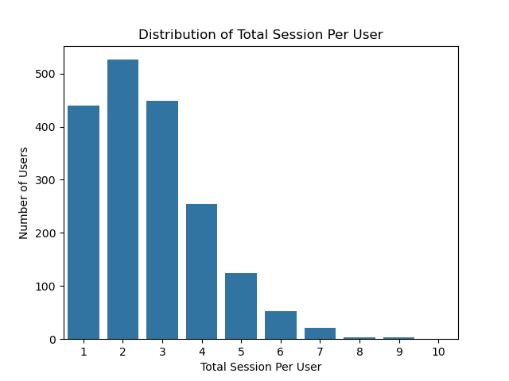

- Journey By Session
  
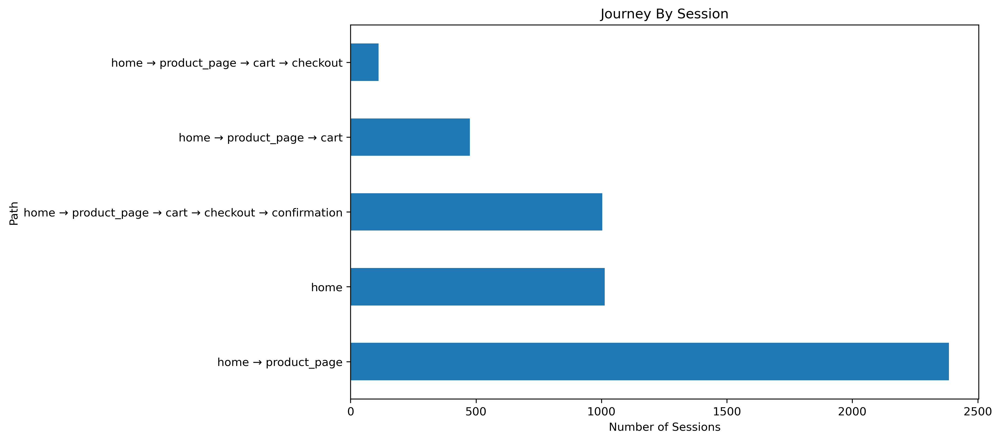

- Average Time on Each Page
  
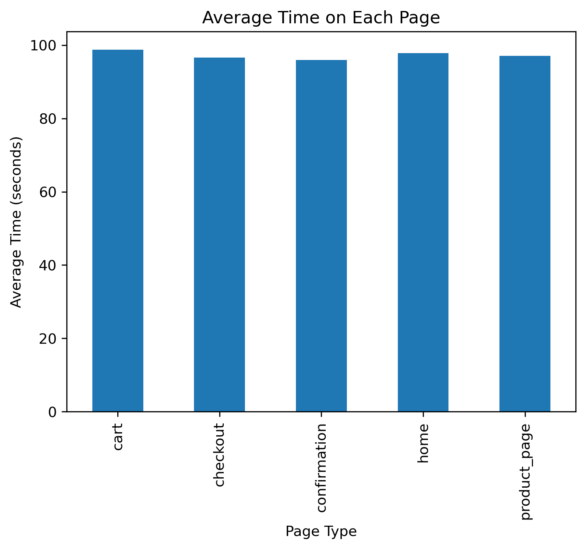   

-  Purchases by Referral Source
 
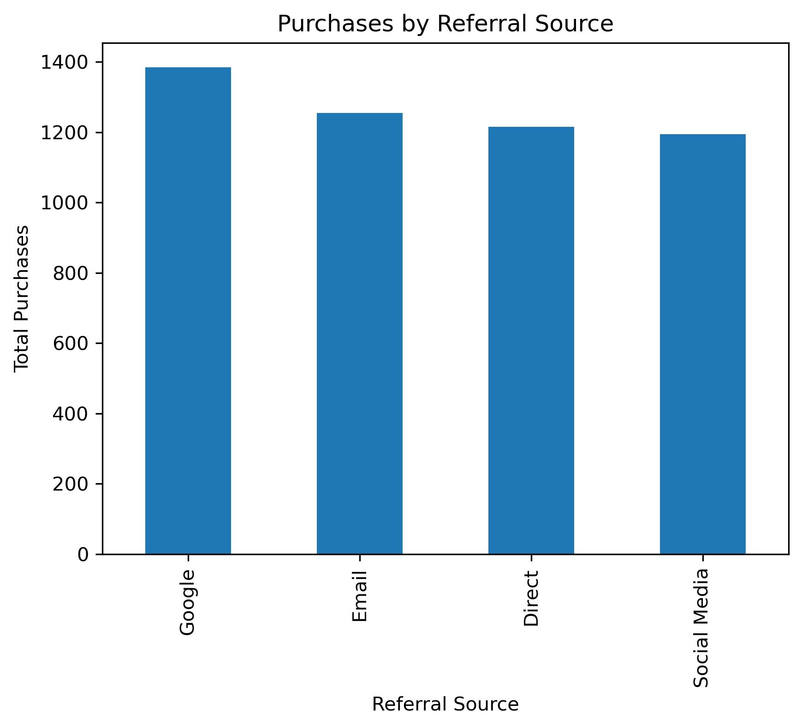

-  Purchases by Country
  
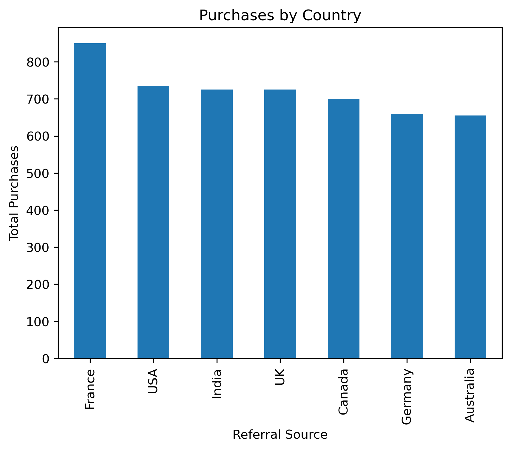

-Funnel Analysis Stages

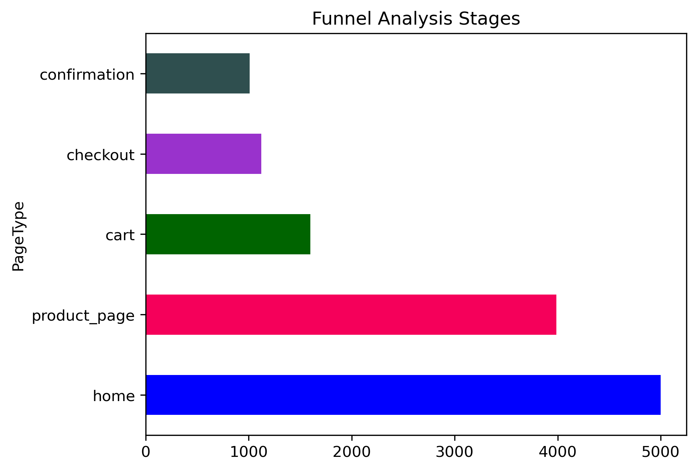

-E-commerce Funnel Analysis

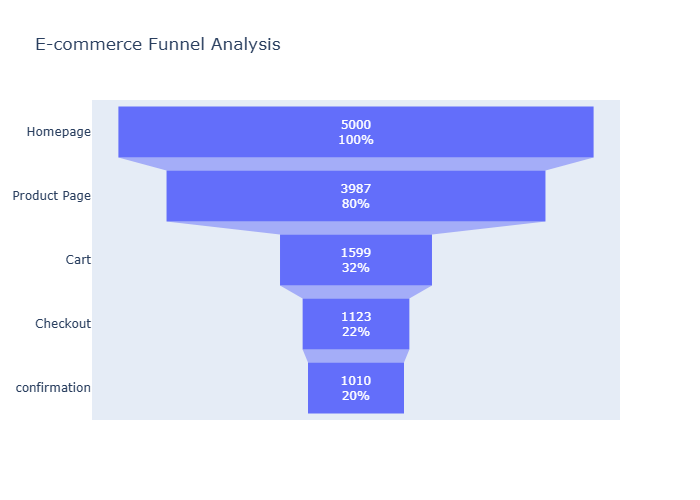
###### we need to check if the problem of cart stage because of any of these reasons
###### 1) the way informations be showed in diffrent type of devices
###### 2) something related to specific country or specific culture
###### 3) something related to time segment like bad night mode or another psychological reason

-Conversion Rate Between Funnel Stages

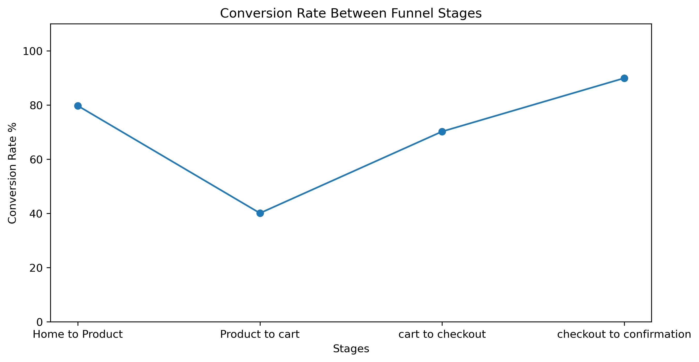

-Funnel Analysis by Device Type

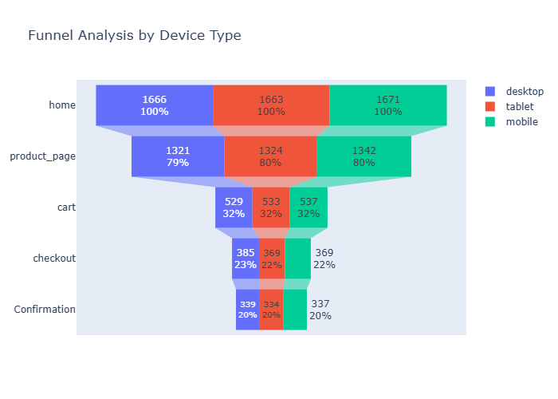

-Funnel Analysis by Countries

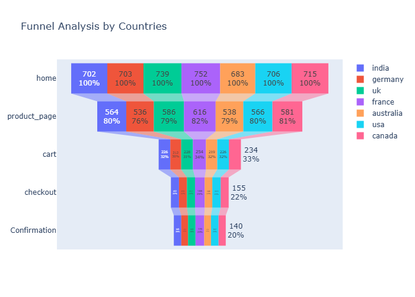

-Funnel Analysis by Time Segment

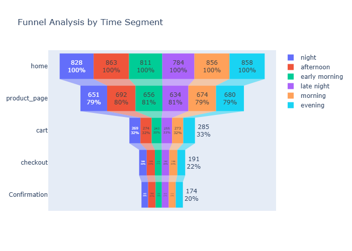

#### then the problem may relate to the price or the product presentation or missing trust signals

## 🔍 Recommendations

1. Competitor price analysis in the market  
2. A/B testing for the “Add to Cart” button  
3. Reviewing product images and descriptions for optimization  
